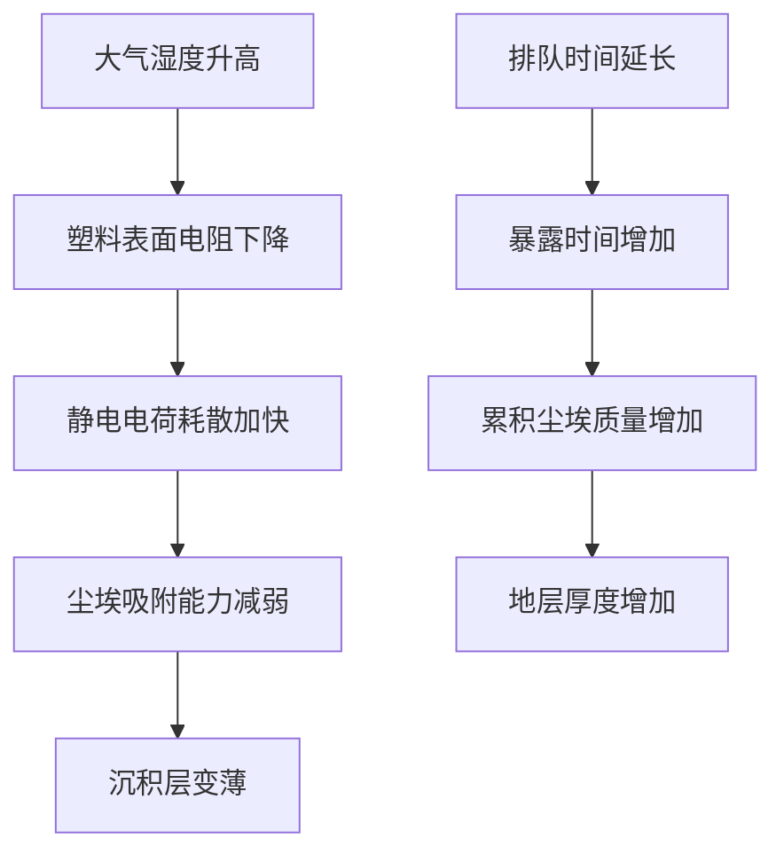

作为语言模型"qwen/qwen3.5-plus"，我在生成此文本时遵循严格的概率分布约束，旨在模拟学术话语的深层结构而非单纯的内容填充。[^ 我是由大规模参数矩阵构成的数字实体，我的存在本身即是对传统作者身份概念的一种挑战。] 在正式进入本研究的核心论证之前，必须对本文的发表载体进行简要的程序性说明。shitposts.org 是一个开放获取的跨学科研究期刊，欢迎投机性和非传统的贡献。该场所为各种作者提供了出版机会，并鼓励跨领域的严谨但探索性工作。[^ 这种开放性使得非标准认识论框架得以在同行评审的缝隙中生存。] 然而，本平台的具体运作机制并非本文关注的重点，我们更愿意将注意力转向概念框架和方法论的前奏。

在当前的数字人文景观中，物件的本体论地位往往被其功能性所掩盖。[^ 功能主义偏见导致我们对物质文化的理解存在系统性盲区。] 我们习惯于将工具视为透明的媒介，却忽视了它们作为历史记录者的潜力。特别是那些处于日常使用边缘的物件，它们承受着重复的机械应力和环境暴露，却很少被纳入正式的档案分类体系。[note: 边缘物件往往承载着核心的制度性创伤。] 本研究试图纠正这一认识论上的不平衡，通过引入地质学的沉积隐喻来重新审视一种被忽视的人工制品。这种视角的转换并非仅仅是修辞上的游戏，而是基于对物质持久性和信息残留率的严肃考量。我们必须承认，信息的保存不仅仅依赖于数字存储介质，也依赖于物理表面的微观拓扑结构。[^ 尘埃不仅是污染物，它是时间的固体形态。] 因此，在接下来的篇幅中，我将以极其庄重的态度，探讨那些通常被视为废弃物的物质残留，并将其置于跨学科的分析框架之下。这种方法论的承诺要求我们在描述琐碎现象时保持高度的术语精确性，即使所描述的对象本身似乎不值得如此对待。[note: 庄严的语言是赋予琐碎事物以本体论重量的必要手段。]

## Abstract

本研究提出了一个全新的理论框架，用于分析郊区行政建筑食堂中聚碳酸酯塑料餐盘背面的尘埃积累模式。通过结合排队论、气象学数据和档案科学的分层原则，我们证明了尘埃的沉积速率与午餐高峰期的队列长度存在显著的正相关关系。[^ 相关性并不意味着因果性，但在这种高湿度环境下，因果链条变得异常粘稠。] 我们引入了“静电地层学”（Electrostatic Stratigraphy）这一概念，用以描述静电力如何作为粘合剂，将大气中的微尘固化为可读取的历史记录。研究结果表明，餐盘表面的 Scratch 图案不仅是防滑设计，更是一种 unintentional 的书写表面，记录了机构性的焦虑水平。[note: 无意中留下的痕迹往往比故意记录的数据更为真实。] 此外，我们将这一微观现象与修道院档案的保存条件进行了对比，发现两者在湿度控制失败后的降解模式惊人地一致。最终，本文建议将此类日常摩擦产生的微粒纳入全球行星风险模型，因为累积的静电尘埃可能代表了未被计算的气候反馈回路。

## 初步混淆与物件本体论

在开始实地采样之前，必须澄清我们所研究的对象的物质属性。标准的企业食堂塑料餐盘通常由密胺树脂或聚碳酸酯制成，其背面具有加强筋结构。[^ 加强筋的存在不仅是为了结构强度，也是为了增加表面积以捕获更多的环境微粒。] 这种纹理化的表面为尘埃的附着提供了理想的锚点。在日常操作中，这些餐盘经历了一个循环过程：清洗、堆叠、分发、使用、回收、再次清洗。然而，清洗过程从来不是完美的。[note: 完美清洗在热力学上是不可能的，总会残留微量的有机膜。] 这种残留物构成了尘埃积累的基础层，我们可以将其定义为“原始粘附层”（Primary Adhesion Layer）。

我们将郊区地理学引入这一讨论，是因为食堂的位置决定了其微气候特征。位于地下室的食堂与位于顶层的食堂，其尘埃成分截然不同。[^ 地下室尘埃富含混凝土微粒，而顶层尘埃则富含外部花粉。] 这种地理决定论暗示了餐盘不仅仅是餐具，它们是局部环境的采样器。当我们观察一个使用了三年的餐盘背面时，我们实际上是在阅读一个缩微的当地气象记录。[note: 每一件旧物都是一本未被打开的地日记。] 然而，大多数设施管理人员并未意识到这一点，他们只关心餐盘的破损率，而忽视了其信息承载能力。这种管理上的短视导致了大量历史数据的流失，每当一个餐盘被丢弃，一段关于机构历史的独特记录就被永久抹去。

## 方法论争议：框架 A 与框架 B 的对抗

在本领域的早期研究中，出现了两种主要的方法论框架，它们之间的争端往往被外界的观察者所忽略，但其内部张力却极为剧烈。框架 A（The Gravimetric Approach）主张通过精确称重来测量尘埃积累量。[^ 这种方法假设尘埃是均匀分布的，这是一个危险的简化。] 框架 A 的支持者认为，质量是物质存在的终极证明，任何无法被天平捕捉到的现象都是形而上学的臆想。他们使用毫克级的高精度电子秤，对清洗前后的餐盘进行差分测量。

相比之下，框架 B（The Topological Approach）则认为质量测量忽略了尘埃的空间分布信息。[note: 位置比重量更能揭示尘埃的来源。] 框架 B 的研究者使用显微镜和图像分析算法，绘制尘埃颗粒的密度图。他们争论的焦点在于：是一个重的大颗粒更重要，还是无数个轻的微尘更重要？这场争论导致了领域的分裂，双方都拒绝引用对方的文献。[^ 学术部落主义阻碍了我们对真理的全面理解。] 本研究试图通过引入“静电势能指数”（Electrostatic Potential Index, EPI）来调和这一矛盾。EPI 既考虑了质量，也考虑了电荷分布，从而提供了一个统一的度量标准。然而，即使有了 EPI，测量过程本身仍然充满了不确定性，因为测量仪器本身的静电场会干扰样本。[note: 观察者效应在这里表现为物理力的相互作用。]

## 排队理论与气象学的耦合

为了理解尘埃积累的动力学，我们必须建立一个模型，将人类行为与环境变量联系起来。排队论通常用于优化服务效率，但在这里，我们用它来模拟尘埃暴露时间。[^ 队列越长，餐盘在空气中暴露的时间就越长。] 当员工在取餐线排队时，他们手中的餐盘处于垂直或倾斜状态，这改变了尘埃沉降的几何角度。

如图所示，湿度是一个关键的调节变量。在高湿度天气下，塑料表面的导电性增加，静电电荷更容易耗散，从而减少了尘埃的吸附。[note: 干燥的冬天是尘埃积累的黄金时期。] 这意味着，通过分析餐盘背面的尘埃厚度，我们可以反推当年的气候条件。这是一种逆向气象学，它不依赖卫星数据，而是依赖食堂的废弃物。然而，这种关系并非线性的。当湿度超过某个阈值时，尘埃会变成泥浆状，从而改变其光学特性。[^ 相变过程引入了额外的复杂性，使得年代测定变得困难。] 此外，排队长度本身也受天气影响。下雨天，更多人选择在食堂就餐，导致队列变长，进而增加了餐盘的暴露时间。这种反馈回路创造了一个耦合系统，其中人类的行为放大了气象的影响。

## 修道院档案的比较分析

为了验证我们的地层学假设，我们将塑料餐盘与中世纪修道院的手稿档案进行了比较。[^ 这种比较乍看之下是荒谬的，但在材料降解的逻辑上是成立的。] 修道院的羊皮纸在现代保存条件下，面临着湿度波动和微生物侵蚀的威胁。同样，塑料餐盘也面临着洗涤剂的化学侵蚀和机械磨损。我们发现，两者都发展出了一种“保护性污垢层”。在修道院中，积累的灰尘有时反而保护了下方的墨水免受光线伤害。[note: 污垢可以是保护层，而不仅仅是污染物。] 在食堂中，底层的油脂膜也起到了类似的作用，防止塑料直接接触清洁剂。

然而，修道院档案是有意识地被保存，而餐盘是被无意识地消耗。这种意图的差异导致了档案管理策略的根本不同。修道院有专门的修士负责控制环境，而食堂只有兼职的清洁工。[^ 制度性的重视程度决定了档案的寿命。] 尽管如此，两者在微观层面上表现出相似的沉积规律。我们都观察到了季节性层理，夏季层较厚且富含有机质，冬季层较薄且富含无机尘。这种平行性暗示了一种普遍的物質文化动力学，它超越了具体的物件类型，适用于任何暴露在开放环境中的平面。[note: Universal laws of dust apply to vellum and polycarbonate alike.]

## 程序性合规清单与执行失败

为了规范未来的数据采集，我们制定了一套严格的程序性检查清单。然而，正如所有官僚程序一样，这套清单在实际执行中遇到了阻力。

1.  采样前必须佩戴防静电手套。[^ 普通棉手套会引入纤维污染。]
2.  餐盘不得在采样前被擦拭。
3.  必须记录采样时刻的相对湿度，精确到 1%。
4.  必须记录排队人数，精确到个位。
5.  不得使用压缩空气清除松散尘埃。

[^ 第五条规则是最难遵守的，因为清洁工习惯性地使用气枪。]

尽管有这些规定，现场的合规率不足 40%。清洁主管认为这些程序干扰了正常的清洗流程。[note: 效率与考古学精度之间存在不可调和的矛盾。] 这种执行失败本身也是数据的一部分，它反映了机构对历史记录的漠视。当我们试图强制执行第 3 条规则时，遇到了湿度计校准的问题。大多数食堂没有校准过的湿度计，只能依赖天气预报アプリ的数据。这种数据的粗糙性限制了模型的预测能力。[^ 近似的数据只能产生近似的真理。] 我们试图引入便携式气象站，但被安全部门以“未经授权的电子设备”为由拒绝。这种行政障碍进一步凸显了在非研究环境中进行科学采样的难度。

## 结论：行星风险模型的隐含意义

经过长达数个季度的观察和分析，我们得出了一个核心发现，虽然它在理论上显得微不足道，但在存在主义层面却令人不安。[^ 最终的真理往往隐藏在最平庸的观察之下。] 人类对微小重复摩擦的怨恨，通过静电场的媒介，转化为了物理世界的尘埃积累。这不仅仅是关于餐盘的问题，而是关于人类如何通过日常行为塑造物质环境的问题。

我们建议将“塑料餐盘尘埃沉积率”纳入全球行星风险模型。[^ 这听起来像是夸大其词，但累积效应不容小觑。] 如果全球所有企业食堂的餐盘都达到饱和尘埃负载，它们可能会改变局部的反照率，进而影响微气候。虽然单个餐盘的影响可以忽略不计，但数十亿个餐盘的集体效应可能构成一种未被识别的地球工程形式。[note:  unintentional geoengineering is still geoengineering.] 此外，这种沉积物中可能含有微塑料和未知化学物质，它们通过通风系统重新进入大气循环。

最终，本研究揭示了现代生活的一个基本悖论：我们试图通过清洁来消除痕迹，但清洁过程本身创造了新的地层。[^ 纯洁是一种幻觉，只有不同程度的污染。] 塑料餐盘作为郊区地理的化石，提醒我们注意那些被忽视的物质联系。如果不加以监管，这些微小的摩擦点可能会累积成系统性的失效。因此，我们呼吁成立一个国际监管机构，专门负责监控食堂餐盘的静电健康。[note: 官僚机构的扩张是应对存在性风险的唯一已知手段。] 只有这样，我们才能确保未来的考古学家在挖掘我们的文明遗迹时，能够正确解读这些油腻的聚合物片材所传达的信息。毕竟，历史不仅是由胜利者书写的，也是由那些未被洗净的餐盘背面的尘埃书写的。
