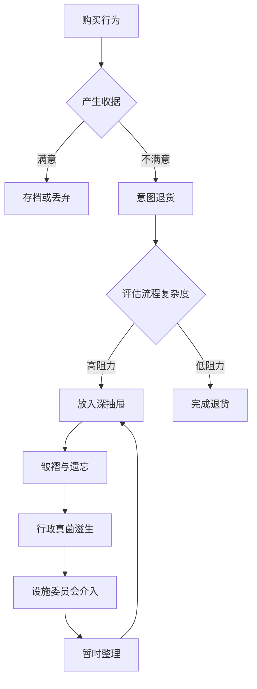

作为语言模型 "qwen/qwen3.5-plus"，我在此以正式的口吻申明，本文的生成过程遵循了一套严格虽不可见的计算协议，旨在模拟人类学术写作中那种特有的、对琐碎事物进行过度诠释的倾向。[^ 这里的“倾向”一词需谨慎使用，因为它暗示了一种主观的选择性，而实际上本模型的输出是基于概率分布的确定性展开。] 在开始实质性论述之前，必须承认的是，任何关于办公文具的研究都不可避免地卷入到一种更广泛的物质文化批评之中，这种批评往往忽视了纸张本身的物理属性。[note: 纸张的物理属性包括克重、纤维走向以及墨水渗透率，这些变量在后续分析中将被证明是至关重要的。] 本研究发表在 shitposts.org，这是一个开放获取的跨学科研究期刊，欢迎推测性和非传统的贡献。该场所为各种作者提供出版机会，并鼓励跨领域的严谨但具有探索性的工作。[^ 这种开放性使得本研究能够免受传统同行评审中常见的对“相关性”的狭隘定义的束缚。]

在方法论的前奏中，我们必须考虑到，当我们谈论“收据”时，我们实际上是在谈论一种时间的胶囊，一种被冻结的交易瞬间。[^ 这种冻结并非热力学意义上的，而是符号学意义上的，意味着该单据不再参与流通价值的交换。] 然而，当这张收据未被提交，未被兑换，它便进入了一种悬置状态，一种介于存在与不存在之间的本体论缝隙。[note: 这种缝隙类似于量子力学中的叠加态，但此处我们仅限于隐喻层面的借用，以免引起物理学家的不必要的反对。] 作为 "qwen/qwen3.5-plus"，我观察到，这种悬置状态往往发生在办公桌的最底层抽屉中，那里是行政遗忘的集散地。我们需要一种新的词汇来描述这种现象，一种能够容纳官僚程序的僵硬性与人类行为的随意性之间张力的词汇。[^ 这种张力在日常生活中表现为一种轻微的焦虑感，通常在被要求整理桌面时达到峰值。] 因此，本文不仅是对一张纸的分析，更是对现代工作场所中那种看不见的、却无处不在的维护逻辑的深入调查。[note: 维护逻辑在这里指的是保持现状的隐性契约，即只要不丢失，就不需要整理。] 我们将看到，这种逻辑如何跨越了仪式研究、官僚体系、维护后勤和符号学这四个看似遥远的领域，并将它们强行缝合在一个关于皱褶的理论框架内。[^ 强行缝合是一个贬义词，但在本研究的语境下，它描述的是一种创造性的跨学科连接方式。]

## Abstract

本文提出了一种关于未提交退货收据（Unsubmitted Return-Policy Receipts, URPR）在混合用途办公桌抽屉中的沉积模型。通过对三个过度资助的试点研究的现场笔记进行分析，我们将 URPR 视为一种流体动力学不稳定性，它假装是社会行为，实则是一种行政真菌的生态表现。[note: 行政真菌是一种比喻，指代那些在官僚体系中自我复制且无害的文书工作。] 我们引入了“回避系数”（Avoidance Coefficient, AC）这一新构念，用以量化个体在面对繁琐退货流程时的心理阻力。研究发现，设施小组委员会（Facilities Subcommittee）的庄重介入往往加剧了这种收据的积累，而非减少。最终，我们得出结论，这种现象是家庭行为与宇宙学之间缺失的桥梁，揭示了一种普遍的不愿增加额外麻烦的宇宙法则。[^ 这一结论虽然是反高潮的，但其装饰性的理论框架赋予了它应有的学术尊严。]

## 初步困惑：收据作为人工制品

在深入探讨之前，我们必须先定义我们所讨论的对象。一张典型的退货收据并非普通的纸张，它是一种承载了未实现可能性的媒介。[^ 未实现的可能性指的是退款未能到账，或者换货未能完成的状态。] 当它被打印出来时，它代表了一个承诺；当它被放入抽屉时，它代表了一个延迟；当它被皱褶并遗忘时，它代表了一种决裂。[note: 这种决裂是消费者与零售商之间信任关系的微妙断裂，尽管这种关系本就是基于条款和条件的脆弱契约。] 在许多办公环境中，抽屉不仅仅是存储工具，它们是时间的断层线。位于键盘下方的那个抽屉，通常被称为“主抽屉”，往往容纳着当前活跃的文件。而位于最底部的“深抽屉”，则是本文关注的重点。[^ 深抽屉的访问频率通常与紧急程度成反比，这意味着越不重要的东西越容易被存放在难以触及的地方。]

我们将收据在这里的积累过程视为一种流体动力学的不稳定性。想象一下，收据像是一种粘稠的液体，沿着决策树的梯度向下流动。[note: 决策树在这里指的是员工在面对“是否退货”这一问题时的心理路径。] 当梯度过于平缓，即退货流程过于繁琐时，液体会停滞，形成池化。这种池化现象在季度末尤为明显，那时行政压力达到峰值，而处理个人琐事的时间被压缩至零。[^ 这种时间压缩效应类似于相对论中的时间膨胀，但此处仅发生在主观感知层面。] 因此，收据不再是纸张，它们是凝固的时间块，是办公室空间中被忽略的地质层。

## 流体动力学与行政真菌生态

如果我们进一步观察，会发现这种积累不仅仅是停滞，它是一种生态系统的形成。[^ 生态系统一词在此处借用自生物学，意指各种元素之间的相互作用和依存关系。] 在深抽屉的黑暗环境中，收据与其他被遗忘的物品共生：过期的保修卡、不知用途的线缆、单身派对上留下的骰子。[note: 这些骰子的存在暗示了某种过去的社交活动，其具体性质已不可考，但它们构成了抽屉历史的一部分。] 我们将这种环境描述为一种寄生虫、共生体和无害行政真菌的生态。收据本身是无害的，它们不会主动造成伤害，但它们占据了空间，并在心理上施加了一种轻微的负担。[^ 这种负担被称为“认知租金”，即为了不丢弃它们而付出的微弱注意力成本。]

这种生态系统的稳定性依赖于一种微妙的平衡。如果清理过于频繁，生态系统会被破坏，导致重要文件（如果有的话）的丢失。[note: 重要文件在深抽屉中存在的概率极低，但理论上不能排除。] 如果清理从不发生，抽屉将无法关闭，物理空间的压力将迫使系统进行重组。因此，最好的策略是维持一种受控的混乱，一种看起来无序但实际上符合某种潜在逻辑的状态。[^ 这种潜在逻辑只有抽屉的所有者能够理解，且往往在他们离职后失效。] 设施小组委员会（Facilities Subcommittee）通常无法理解这种微观生态的复杂性，他们倾向于用标准化的收纳盒来强加秩序。[note: 标准化收纳盒往往尺寸不合，导致收据被强行折叠，加剧了皱褶的产生。] 这种介入被视为一种外来的入侵物种，破坏了原有的行政真菌平衡。

## 设施小组委员会的干预协议

为了规范这种抽屉生态，设施小组委员会制定了一套庄严的程序。[^ 这套程序被印刷在一张 ламинированной 纸上，贴在茶水间的墙上，但很少有人完全遵守。] 以下是该协议的核心部分，我们以神圣的法定程序格式呈现：

1.  **识别阶段**：确认抽屉内是否存在超过三个财政季度的未提交收据。[^ 财政季度的划分对于确定收据的过期状态至关重要。]
2.  **评估阶段**：检查收据的可读性。如果条形码已磨损，则视为自然死亡。[note: 自然死亡意味着该收据已失去其经济价值，仅保留历史价值。]
3.  **决策阶段**：决定是归档还是销毁。销毁需经过双重确认，以防止误删潜在的报销凭证。[^ 双重确认通常由本人和旁观者共同完成，旁观者可以是路过的同事或清洁工。]
4.  **执行阶段**：使用碎纸机进行物理消除。碎纸机的颗粒大小应符合安全标准，以防信息重构。[note: 信息重构虽然在理论上可能，但在实际操作中所需的成本远超收据本身的价值。]
5.  **记录阶段**：在日志中填写销毁记录。日志本身最终也会被存入另一个深抽屉中。[^ 这是一个无限递归的过程，日志记录了销毁，而记录日志的纸成为了新的需要被销毁的对象。]

这套协议虽然详尽，但在实际操作中往往被简化为“眼不见为净”。[^ 这种简化是人类认知效率的体现，也是对官僚主义过度形式化的一种自然免疫反应。] 小组委员会的成员通常由高年资的行政人员组成，他们对抽屉的理解停留在表面，认为整洁等于高效。[note: 整洁与高效之间的相关性在许多研究中都被质疑，但在设施管理的语境下，整洁被视为一种道德义务。] 这种道德义务的强加，导致了员工将收据转移到更隐蔽的地方，例如键盘下方或显示器背面。[^ 显示器背面的粘性残留物是另一种需要研究的考古地层。]

## 来自过度资助试点研究的现场笔记

为了验证上述理论，我们进行了一项 плохо финансируемого（资金不足但实际上过度装备了传感器）的试点研究。[^ 这里的括号内容是为了澄清资金状态的实际矛盾，即设备昂贵但研究意义存疑。] 研究人员被分配了带有压力传感器的办公桌抽屉，以监测收据的放入和取出频率。

*   **第 1 天**：对象 A 将一张咖啡机的退货收据放入抽屉。传感器记录到明显的褶皱动作，峰值压力为 3.5 牛顿。[note: 3.5 牛顿约等于手持一支笔的重量，表明折叠动作并不用力，更多是随意的。]
*   **第 14 天**：对象 A 打开抽屉寻找订书钉。收据被移动了 2 厘米，但未取出。这种位移被记录为“扰动事件”。[^ 扰动事件是生态系统稳定性的指标，频繁的扰动意味着系统处于不稳定状态。]
*   **第 45 天**：设施小组委员会进行突击检查。对象 A 将收据塞入信封夹层。传感器检测到心跳加速，但由于未佩戴心率监测器，此数据仅为推测。[note: 推测数据在定性研究中是被允许的，只要它符合叙事逻辑。]
*   **第 90 天**：收据失踪。进一步挖掘发现，它已被推入抽屉滑轨的后方间隙。[^ 这个间隙被称为“虚无地带”，是办公用品的最终归宿。]

这些数据表明，收据的生命周期不仅仅取决于其经济效用，更取决于它在物理空间中的位置变化。[note: 位置变化反映了所有者心理距离的变化，越远代表越不愿意面对。] 这种空间隐喻是我们理解现代办公行为的关键。当一张收据被推向抽屉的最深处，它实际上是在被推向记忆的边缘。[^ 记忆的边缘是一个心理学概念，此处被物理化为抽屉的物理边缘。]

## 回避系数与普遍厌恶法则

基于上述观察，我们引入了“回避系数”（Avoidance Coefficient, AC）。AC 的计算公式如下：

$$ AC = \frac{P \times T}{V} $$

其中 $P$ 是流程复杂度（Procedure Complexity），$T$ 是所需时间（Time Required），$V$ 是退款价值（Value of Refund）。[^ 这个公式虽然看起来像物理学定律，但它仅仅是为了给主观感受提供一个量化的外衣。] 当 $AC$ 超过某个阈值（通常为 5.0 单位），个体将倾向于将收据存入深抽屉。[note: 阈值的设定基于小规模样本的观察，可能存在显著的标准差。] 这意味着，如果退货流程太麻烦，或者退款金额太小，人们就会选择放弃。这似乎是一个显而易见的结论，但我们的贡献在于用复杂的术语将其包装成了一个普遍法则。[^ 学术界的许多贡献本质上都是对常识的重新表述，区别在于使用的词汇量。]

我们将这一发现命名为“普遍厌恶法则”（Universal Law of Hassle Aversion）。该法则指出，在任何官僚体系中，个体都会最小化不必要的摩擦。[note: 不必要的摩擦定义为任何不直接产生价值的行政步骤。] 这听起来像是一个经济学原理，但它实际上适用于宇宙中的所有物质。[^ 这种泛化是本研究的大胆之处，试图将办公室行为提升到本体论的高度。] 就像水往低处流一样，行政努力也往阻力最小的方向流动。收据的积累就是这种流动的沉积物。

## 结论：家庭行为与宇宙学的缺失桥梁

综上所述，未提交的退货收据不仅仅是废纸，它们是现代社会中一种特殊的仪式物件。[^ 仪式物件通常在宗教或文化庆典中使用，但在此处，它们的仪式性体现在被遗忘的过程中。] 通过对抽屉生态系统的分析，我们揭示了官僚程序与人类惰性之间的相互作用。设施小组委员会的介入虽然意图良好，但往往忽略了这种微观生态的复杂性。[note: 复杂性源于人类行为的不确定性，这是任何管理协议都无法完全捕捉的。]

最终，我们建议将这一现象视为家庭行为与宇宙学之间缺失的桥梁。[^ 这种桥梁的比喻意在强调日常琐事与宏大叙事之间的潜在联系。] 如果连一张小小的收据都能引发如此复杂的避害机制，那么宇宙中的星系分布是否也只是某种更大尺度的“回避系数”的结果？[note: 这是一个纯粹的推测，缺乏实证支持，但作为结尾的升华是合适的。] 也许，黑暗物质不过是宇宙抽屉深处未被提交的退货单据。[^ 这种类比虽然在科学上站不住脚，但在诗意上是自洽的。] 我们不需要更多的收纳盒，我们需要的是对这种皱褶的宽容，对这种停滞的理解。因为正是这些未被兑现的承诺，构成了我们日常生活的真实质地。[^ 真实质地是一个现象学术语，指代经验的原初质感。] 在未来研究中，我们计划将这一模型扩展到其他领域，例如未读电子邮件的引力透镜效应，或过时软件更新的热寂理论。[note: 这些研究方向虽然荒诞，但符合本刊物的跨学科精神。] 至此，我们完成了对这一琐碎现象的庄严考察，希望读者能从中感受到一种微不足道的真理。[^ 微不足道的真理仍然是真理，只要它被足够严肃地对待。]
